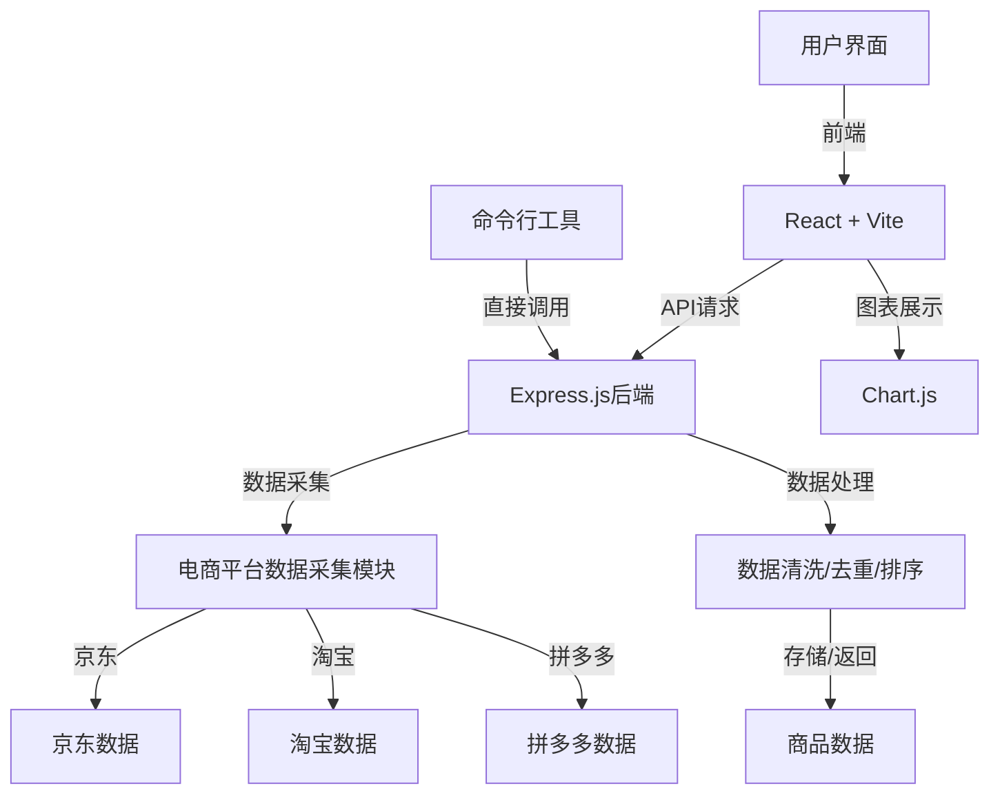
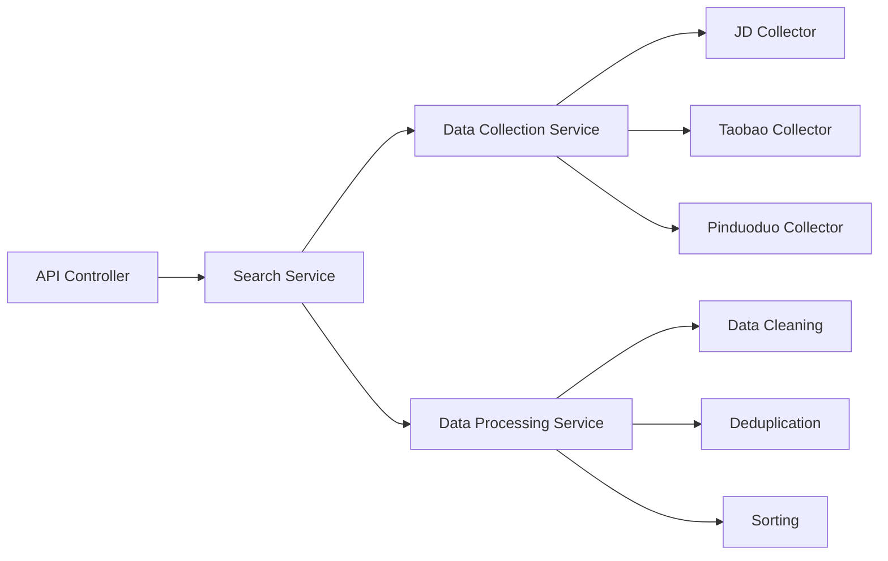
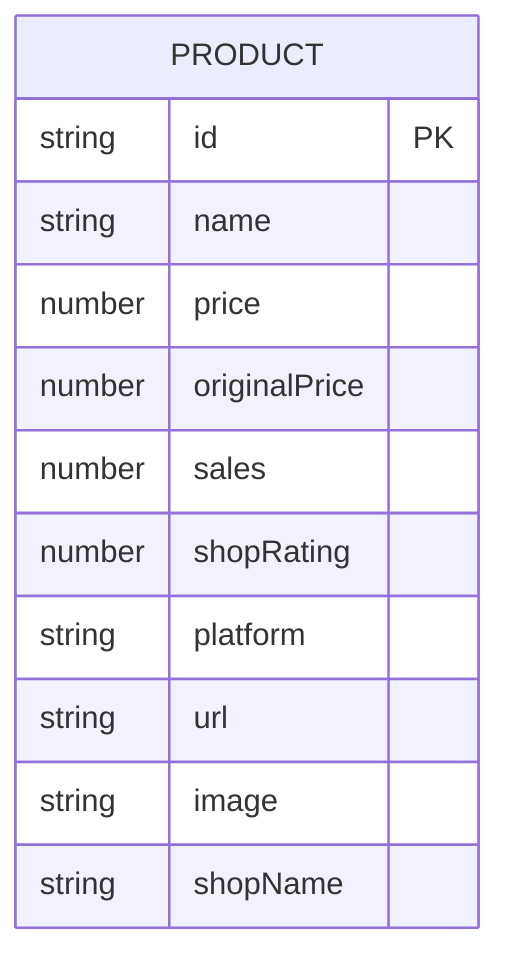

## 1. Architecture Design


## 2. Technology Description
- 前端: React@18 + TypeScript + tailwindcss@3 + vite
- 初始化工具: vite-init
- 后端: Express@4 + TypeScript
- 图表库: Chart.js + react-chartjs-2
- 其他: 不需要数据库，使用内存存储临时数据
- 命令行工具: Node.js + Commander.js

## 3. Route Definitions
| Route | Purpose |
|-------|---------|
| / | 首页，搜索和数据示例 |
| /results | 商品对比结果页面 |
| /api/search | 后端API，执行商品搜索和采集 |

## 4. API Definitions
### 4.1 Search API
```typescript
// Request
interface SearchRequest {
  keyword: string;
}

// Response
interface Product {
  id: string;
  name: string;
  price: number;
  originalPrice?: number;
  sales: number;
  shopRating: number;
  platform: 'jd' | 'taobao' | 'pinduoduo';
  url: string;
  image?: string;
  shopName: string;
}

interface SearchResponse {
  success: boolean;
  data: Product[];
  timestamp: number;
}
```

## 5. Server Architecture Diagram


## 6. Data Model
### 6.1 Data Model Definition


### 6.2 数据结构说明
无需物理数据库，使用内存存储，数据结构如上Product接口定义。
