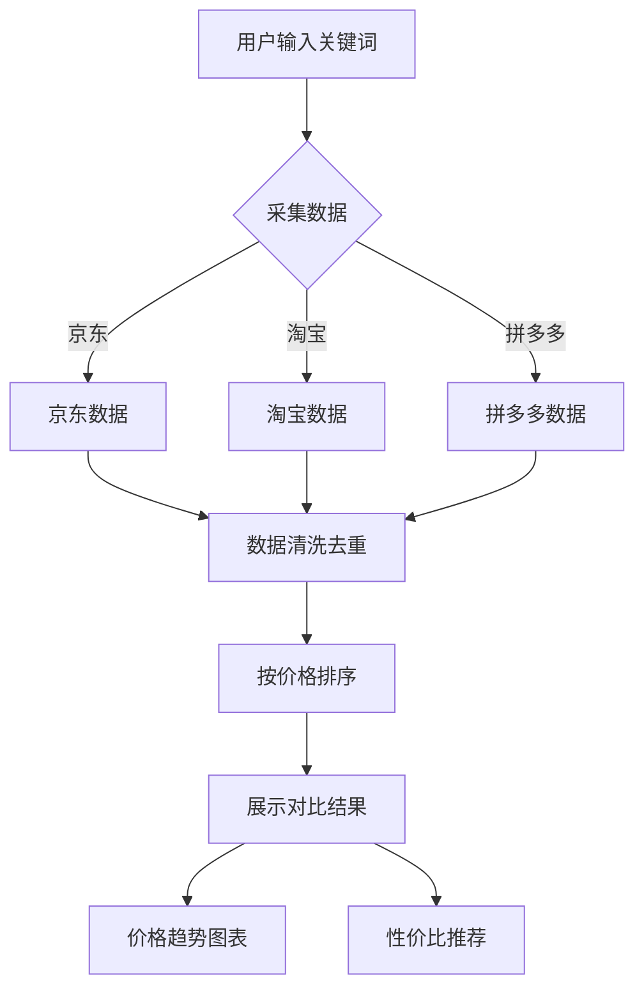

## 1. Product Overview
电商商品价格自动化采集与对比工具，帮助用户快速获取主流电商平台商品信息并进行横向对比。
- 主要目的：批量采集京东、淘宝、拼多多等平台商品数据，支持按关键词搜索，提供价格排序、横向对比和性价比推荐功能。
- 目标用户：需要价格比较的消费者、商品分析师、采购人员。

## 2. Core Features

### 2.1 User Roles
| Role | Registration Method | Core Permissions |
|------|---------------------|------------------|
| Normal User |无需注册 |使用所有功能，包括搜索、查看、导出数据 |

### 2.2 Feature Module
1. **首页**：搜索框、初始化数据示例、功能介绍
2. **商品对比页面**：搜索结果展示、价格排序、商品对比表格、价格趋势图表、性价比推荐
3. **命令行工具**：支持命令行输入关键词进行采集

### 2.3 Page Details
| Page Name | Module Name | Feature description |
|-----------|-------------|---------------------|
| 首页 | 搜索框 | 支持输入关键词进行商品搜索，一键采集各平台数据 |
| 首页 | 数据示例 | 展示一个示例关键词（如"iPhone 15"）的采集结果示例 |
| 商品对比页面 | 商品列表 | 按价格从低到高排序，展示商品名称、价格、销量、店铺评分、平台等信息 |
| 商品对比页面 | 价格趋势图表 | 使用Chart.js展示不同平台价格对比图表 |
| 商品对比页面 | 性价比推荐 | 自动标注性价比高的商品 |

## 3. Core Process
用户在网页或命令行输入关键词 → 系统采集各平台商品数据 → 数据清洗去重 → 按价格排序 → 展示商品列表、对比表格、价格图表和推荐 → 用户可查看详情

## 4. User Interface Design
### 4.1 Design Style
- 主色调：深蓝色(#165DFF)搭配浅灰色背景
- 按钮风格：圆角矩形，带有轻微阴影，hover效果
- 字体：Inter作为主要字体，标题加粗
- 布局风格：卡片式布局，清晰的模块分隔
- 图标风格：使用简洁的线性图标

### 4.2 Page Design Overview
| Page Name | Module Name | UI Elements |
|-----------|-------------|-------------|
| 首页 | Hero section | 居中的搜索框，醒目的标题，功能介绍卡片 |
| 首页 | 数据示例 | 折叠式示例区域，展示完整的示例数据和结果 |
| 商品对比页面 | 商品列表 | 表格布局，支持排序，鼠标悬停高亮 |
| 商品对比页面 | 价格图表 | 折线图/柱状图展示各平台价格对比 |

### 4.3 Responsiveness
桌面端优先，移动端自适应，确保在不同设备上都有良好的显示效果。

### 4.4 3D Scene Guidance
本项目不涉及3D场景。
